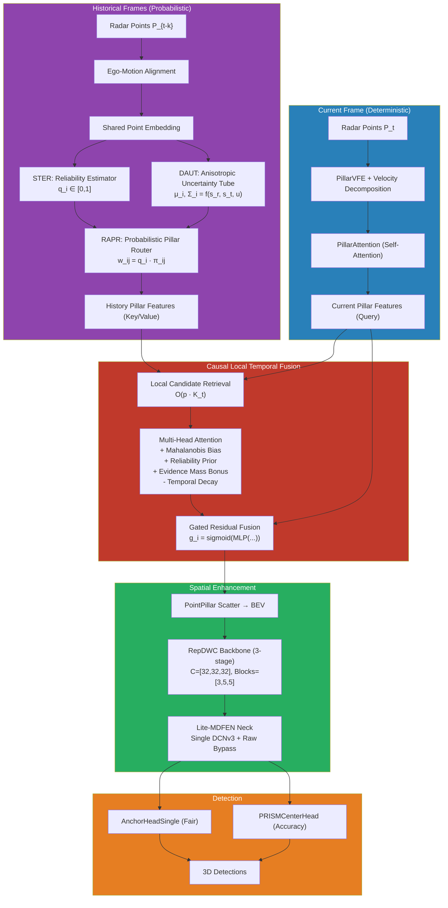

<div align="center">

# PRISM-Pillars-RF: Physics-Guided Reliable Temporal Evidence Fusion

<div align="center"><b>with Re-parameterized Foreground Refinement for 4D Radar 3D Object Detection</b></div>

[](https://www.python.org/)
[](https://pytorch.org/)
[](LICENSE)
[](https://github.com)

</div>

> **This work is currently under development.**
> Pre-trained model weights and full reproduction details will be released upon paper acceptance.
> Please do not use or redistribute without written permission from the authors.

---

## Table of Contents

- [Overview](#overview)
- [Methodology: Correct-then-Refine](#methodology-correct-then-refine)
- [Architecture](#architecture)
- [Novel Contributions](#novel-contributions)
- [Module Breakdown](#module-breakdown)
- [Project Structure](#project-structure)
- [Installation](#installation)
- [Dataset Preparation](#dataset-preparation)
- [Training \& Evaluation](#training--evaluation)
- [Development Roadmap](#development-roadmap)
- [Module Exit Criteria](#module-exit-criteria)
- [Testing](#testing)
- [Baseline Results](#baseline-results-radarpillars)
- [Comparison with Recent SOTA](#comparison-with-recent-sota)
- [Citation](#citation)
- [Acknowledgement](#acknowledgement)

---

## Overview

**PRISM-Pillars-RF** is a 4D mmWave imaging radar 3D object detector that elevates the RadarPillars baseline ([Gillen et al., IROS 2024](https://arxiv.org/abs/2408.05020)) with a hierarchical **Correct-then-Refine** framework. The core insight is:

> *Historical radar returns are uncertain probabilistic evidence, not deterministic geometry. Reliable multi-frame detection requires correcting temporal evidence in raw point space **before** enhancing spatial representations in BEV feature space.*

The project integrates:
- **PRISM** — probabilistic temporal evidence modeling with Doppler-aware anisotropic uncertainty and self-supervised reliability
- **RadarNeXt** — re-parameterizable depthwise convolution (RepDWC) backbone and single-deformable foreground refinement neck (MDFEN) ([Jia et al., 2025](https://link.springer.com/article/10.1186/s13634-025-01271-2))

Built on [OpenPCDet](https://github.com/open-mmlab/OpenPCDet), the codebase supports both the original RadarPillars pipeline for fair baseline comparison and the full PRISM-Pillars-RF pipeline for SOTA performance.

**Supported Datasets:**

| Dataset | Classes | Radar Features | Temporal |
|---|---|---|---|
| **View-of-Delft (VoD)** | Car, Pedestrian, Cyclist | x, y, z, RCS, v_r, v_r_comp, time | 3-5 frame sequences |
| **TJ4DRadSet** | Car, Pedestrian, Cyclist | x, y, z, RCS, v_r, v_r_comp, time | 3-5 frame sequences |
| **Astyx HiRes2019** | Car, Pedestrian | x, y, z, RCS, v_r | Single frame |

---

## Methodology: Correct-then-Refine

The model follows a strict architectural discipline:

```
┌─────────────────────────────────────────────────────────────────┐
│  Point-Level Physical Correction                                │
│  Doppler anisotropic uncertainty → Self-supervised reliability  │
│  → Probabilistic evidence routing                                │
├─────────────────────────────────────────────────────────────────┤
│  Probabilistic Temporal Fusion                                  │
│  Causal local pillar attention with Mahalanobis + reliability   │
│  + evidence mass + temporal decay priors                        │
├─────────────────────────────────────────────────────────────────┤
│  Efficient Spatial Refinement                                   │
│  RepDWC re-parameterizable backbone → Single-DCNv3 raw-bypass   │
│  multi-scale foreground enhancement                             │
└─────────────────────────────────────────────────────────────────┘
```

**Two architectural invariants:**
1. **Current frame never undergoes probabilistic diffusion** — its coordinates are direct observations; preserving them via the original RadarPillars deterministic encoding prevents contour smoothing.
2. **DCNv3 never precedes physical evidence modeling** — deformable convolution changes spatial responses, so it must be applied after the physically-grounded temporal fusion.

---

## Architecture



---

## Novel Contributions

### 1. Doppler-Aware Anisotropic Probabilistic Evidence (DAUT)

Historical radar returns are modeled as **anisotropic Gaussian distributions** aligned with the radar's line-of-sight geometry. Doppler directly constrains radial motion but leaves tangential motion poorly observable — this physical asymmetry is explicitly encoded:

```
Σ_i = s_r² · u·u^T + s_t² · n·n^T + σ_0² · I
```

with the physical constraint `s_t ≥ s_r` enforced through a bounded learnable parameterization.

### 2. Self-Supervised Temporal Evidence Reliability (STER)

A lightweight MLP estimates per-point reliability `q_i ∈ [0,1]` without requiring additional annotations. Pseudo-labels are constructed from current-frame spatial support via Mahalanobis matching, combined with Focal BCE and pairwise ranking loss for training.

### 3. Causal Reliability-Aware Local Pillar Fusion (CRLF)

Current pillars act as **queries** that selectively attend to local historical probability evidence. Attention scores incorporate five distinct priors:

| Prior | Mechanism | Role |
|---|---|---|
| Feature similarity | Scaled dot-product (Q·K^T) | Standard attention |
| Geometric consistency | Mahalanobis bias b_ij^geo | Spatial uncertainty awareness |
| Reliability | α · log(q̄_j + ε) | Down-weight unreliable history |
| Evidence mass | γ · log(1 + m_j) | Boost well-supported pillars |
| Temporal distance | -β · |Δt_j| | Favor recent observations |

A learned gating mechanism controls the fusion: `F_i^out = F_i + g_i · Ĥ_i`, where `g_i` depends on attention entropy, max attention weight, and pillar quality indicators.

### 4. Efficient Engineering Components (from RadarNeXt)

- **RepDWC Backbone**: Multi-branch depthwise convolutions during training, fused to single-path at deployment. Parameter reduction ~71% vs. PointPillars.
- **Single-DCNv3 Raw-Bypass MDFEN**: Only one deformable convolution applied to high-resolution raw features, with an untouched raw feature path preserving original point cloud information.

---

## Module Breakdown

| Module | Paper Section | File | Function |
|---|---|---|---|
| **RadarPointEmbedding** | §4 | `radar_evidence/radar_point_embedding.py` | Unified point features: x, y, z, log_rcs, v_rel, v_comp, v_x, v_y, Δt, range, sin/cos azimuth, local stats |
| **STER** | §5 | `radar_evidence/temporal_reliability.py` | MLP → Sigmoid: q_i ∈ [0,1] |
| **TemporalSupportBuilder** | §5.2 | `radar_evidence/temporal_support_builder.py` | Mahalanobis matching for self-supervised pseudo-labels |
| **DAUT** | §6 | `radar_evidence/doppler_uncertainty_tube.py` | Bounded σ_v,r, σ_v,t → Σ_i; fixed or learnable |
| **RAPR** | §7 | `radar_evidence/probabilistic_pillar_router.py` | Geometry-first normalization, reliability-second weighting; evidence mass gating |
| **CRLF** | §8 | `temporal/causal_local_pillar_fusion.py` | Local multi-head attention + 5 priors + gated fusion |
| **RepDWC** | §9 | `backbones_2d/rep_dwc.py` | Train: multi-branch DW+PW+BN; Deploy: fused single-path |
| **RepBEVBackbone** | §9 | `backbones_2d/rep_bev_backbone.py` | 3-stage [3,5,5] uniform channel backbone |
| **Lite-MDFEN** | §10 | `backbones_2d/lite_mdfen.py` | Top-down + single DCNv3 + raw bypass + bottom-up |
| **PRISMCenterHead** | §11 | `dense_heads/prism_center_head.py` | Anchor-free: heatmap + offset + size + yaw + velocity + IoU |
| **PRISMPillarsRF** | §15 | `detectors/prism_pillars_rf.py` | Full Correct-then-Refine detector |

### Loss Functions

```
L = L_det + λ_rel · L_rel + λ_sigma · L_sigma + λ_inv · L_inv
```

| Loss | Weight | Description |
|---|---|---|
| L_det | 1.0 | Detection head loss (Focal + L1 + dIoU + direction) |
| L_rel | 0.20 | Self-supervised reliability: FocalBCE + 0.2 × RankingLoss |
| L_sigma | 0.01 | Uncertainty regularization: prevent sigma blow-up, enforce s_t ≥ s_r |
| L_inv | 0.05 | Cross-augmentation feature consistency (foreground regions only) |

---

## Project Structure

```
PRISM-Pillars/
├── pcdet/
│   ├── datasets/
│   │   ├── vod/
│   │   │   ├── vod_dataset.py              # VoD dataset (single-frame)
│   │   │   └── sequence_loader.py          # Multi-frame sequence loader
│   │   ├── tj4dradset/                     # TJ4DRadSet (future)
│   │   └── augmentor/
│   │
│   ├── models/
│   │   ├── radar_evidence/                 # ★ PRISM core modules
│   │   │   ├── radar_point_embedding.py
│   │   │   ├── temporal_reliability.py     # STER (§5)
│   │   │   ├── temporal_support_builder.py
│   │   │   ├── doppler_uncertainty_tube.py # DAUT (§6)
│   │   │   └── probabilistic_pillar_router.py # RAPR (§7)
│   │   │
│   │   ├── temporal/                       # ★ Temporal fusion
│   │   │   ├── local_candidate_retriever.py
│   │   │   ├── mahalanobis_bias.py
│   │   │   └── causal_local_pillar_fusion.py # CRLF (§8)
│   │   │
│   │   ├── backbones_2d/
│   │   │   ├── rep_dwc.py                  # RepDWC block (§9)
│   │   │   ├── rep_bev_backbone.py         # 3-stage backbone
│   │   │   ├── reparameterize.py           # Conv+BN fusion utilities
│   │   │   ├── dcnv3_wrapper.py            # DCNv3 with fallback
│   │   │   └── lite_mdfen.py               # SR-MDFEN neck (§10)
│   │   │
│   │   ├── backbones_3d/vfe/
│   │   │   └── pillar_vfe.py               # Velocity decomposition VFE
│   │   │
│   │   ├── dense_heads/
│   │   │   ├── anchor_head_single.py       # Fair baseline head
│   │   │   └── prism_center_head.py        # Accuracy head (§11)
│   │   │
│   │   └── detectors/
│   │       ├── pointpillar.py              # Original RadarPillars
│   │       └── prism_pillars_rf.py         # ★ PRISM-Pillars-RF (§15)
│   │
│   └── utils/
│       ├── radar_geometry.py               # LOS, velocity decompose, azimuth
│       ├── covariance_2d.py                # Anisotropic Σ, Mahalanobis
│       └── loss_utils.py                   # FocalBCE, Ranking, DIoU, Ghost
│
├── tools/
│   ├── cfgs/
│   │   ├── vod_models/
│   │   │   ├── vod_radarpillar.yaml        # Baseline config
│   │   │   └── prism_pillars_rf_s.yaml     # PRISM-Pillars-RF-S config
│   │   └── tj4d_models/
│   ├── train.py
│   ├── test.py
│   ├── convert_to_deploy.py                # RepDWC deploy conversion
│   └── benchmark_latency.py                # Per-module timing
│
├── tests/
│   ├── test_time_sign.py                   # Doppler direction validation
│   ├── test_covariance.py                  # Σ positive definiteness, σ_t ≥ σ_r
│   ├── test_probability_conservation.py    # Σπ ≈ 1, Σw ≈ q_i
│   ├── test_reliability_weight.py          # q₁ > q₂ ⇒ Σw₁ > Σw₂
│   ├── test_causal_sequence.py             # Future data isolation
│   ├── test_rep_parameterization.py        # Training ≈ Deploy (FP32 < 1e-4)
│   └── test_dcn_shape.py                   # NCHW shape consistency
│
└── docs/
    ├── paper_plans/
    │   └── great_upgrade_3.md              # Full paper plan
    └── visualizations/
```

---

## Installation

**Requirements:** Python 3.8+, PyTorch 2.4+, CUDA 12.x, spconv

```bash
# Create environment
python -m venv .venv
source .venv/bin/activate  # or .venv\Scripts\activate on Windows
python -m pip install -U pip

# Install with CUDA extensions
python setup.py develop

# Optional: WandB for experiment tracking
pip install wandb

# Optional: DCNv3 support (MMCV)
pip install mmcv-full -f https://download.openmmlab.com/mmcv/dist/cu121/torch2.4/index.html
```

If DCNv3 (MMCV) is unavailable, the `DCNv3Wrapper` automatically falls back to standard Conv2d — model accuracy may decrease by ~1-2 mAP but training/inference remain functional.

---

## Dataset Preparation

### View-of-Delft (VoD)

```
data/VoD/view_of_delft_PUBLIC/radar_5frames/
├── ImageSets/{train,val,test}.txt
├── training/{velodyne,label_2,calib,image_2}/
└── testing/{velodyne}/
```

```bash
# Generate info files + GT database
python -m pcdet.datasets.vod.vod_dataset create_vod_infos \
    tools/cfgs/dataset_configs/vod_dataset_radar.yaml
```

**For multi-frame training (PRISM-Pillars-RF):** sequence consecutive frames are loaded by `sequence_loader.py`. The data split is performed at sequence level to prevent temporal leakage.

### TJ4DRadSet

```
data/TJ4DRadSet/
├── ImageSets/
├── training/
└── testing/
```

### Astyx HiRes2019

```bash
python -m pcdet.datasets.astyx.astyx_dataset create_astyx_infos \
    tools/cfgs/dataset_configs/astyx_dataset_radar.yaml
```

---

## Training & Evaluation

### Baseline: RadarPillars

```bash
# Train
python tools/train.py --cfg_file tools/cfgs/vod_models/vod_radarpillar.yaml --batch_size 16

# Evaluate
python tools/test.py --cfg_file tools/cfgs/vod_models/vod_radarpillar.yaml --ckpt <path>
```

### PRISM-Pillars-RF-S (Fair Comparison)

Uses C=32, 3 historical frames, RepDWC backbone, single DCNv3 Lite-MDFEN, AnchorHead:

```bash
python tools/train.py --cfg_file tools/cfgs/vod_models/prism_pillars_rf_s.yaml --batch_size 8
```

### PRISM-Pillars-RF-C (Maximum Accuracy)

Uses C=48, 5 historical frames, learned uncertainty, CenterHead + IoU/dIoU:

```bash
# Config coming soon
python tools/train.py --cfg_file tools/cfgs/vod_models/prism_pillars_rf_c.yaml --batch_size 4
```

### Deployment Conversion

Convert RepDWC from multi-branch training mode to fused single-path:

```bash
python tools/convert_to_deploy.py \
    --cfg_file tools/cfgs/vod_models/prism_pillars_rf_s.yaml \
    --ckpt <checkpoint.pth> \
    --output deploy_model.pth \
    --validate
```

### Latency Benchmarking

```bash
python tools/benchmark_latency.py \
    --cfg_file tools/cfgs/vod_models/prism_pillars_rf_s.yaml \
    --ckpt <checkpoint.pth> \
    --iterations 1000 --warmup 100
```

### Key Hyperparameters

| Parameter | RadarPillars Baseline | PRISM-Pillars-RF-S |
|---|---|---|
| Pillar Channels | 32 | 32 |
| Historical Frames | 5 (naive acc.) | 3 (probabilistic) |
| Top-K Candidates | — | 16 |
| Reliability α | — | 1.0 |
| Evidence Mass γ | — | 0.5 |
| Time Decay β | — | 1.0 |
| Backbone | BaseBEVBackbone (Conv2D) | RepBEVBackbone (RepDWC) |
| Neck | — | Lite-MDFEN |
| Head | AnchorHeadSingle | AnchorHeadSingle |
| Learning Rate | 0.01 | 0.003 |
| Epochs | 60 | 80 |
| λ_rel | — | 0.20 |
| λ_sigma | — | 0.01 |
| λ_inv | — | 0.05 |

---

## Development Roadmap

The implementation follows a staged development protocol (Paper §17):

| Stage | Description | Status |
|---|---|---|
| **P0** | RadarPillars strict reproduction (1/3/5 frame) | ✅ Complete |
| **P1** | Temporal baselines (naive → ego-motion → deterministic Doppler → isotropic → fixed anisotropic) | 🔨 In Progress |
| **P2** | Local temporal fusion (q=1, σ fixed) | ✅ Code Ready |
| **P3** | Reliability training (warmup, λ_rel linear ramp) | ✅ Code Ready |
| **P4** | Learnable uncertainty (frozen reliability 5 epochs → joint) | ✅ Code Ready |
| **P5** | RepDWC Backbone replacement (compare: Dense/DW/RepDWC train/deploy) | ✅ Code Ready |
| **P6** | Lite-MDFEN ablation (7 configs: no DCN, single DCN high/mid/low, two DCN, no bypass, final) | ✅ Code Ready |
| **P7** | Detection head experiments (AnchorHead vs CenterHead with/without IoU/dIoU/corner) | ✅ Code Ready |
| **P8** | Joint fine-tuning (reduced LR, stage-specific multipliers) | 🔜 Pending |

---

## Module Exit Criteria

Each borrowed module has a defined exit criterion (Paper §26). If a module degrades performance, it is removed from the final model:

| Module | Exit Criterion | Fallback |
|---|---|---|
| **RepDWC** | ΔmAP < -0.3 | RadarPillars Conv2D backbone |
| **MDFEN** | ΔmAP < 0.5 **or** ΔLatency > +10% | RepDWC-only (no neck) |
| **CenterHead** | ΔmAP < 0.5 **or** ΔLatency > +10% | AnchorHeadSingle |
| **Learned Σ** | Unstable training | Fixed σ_r = 0.10 + 0.15·|Δt|, σ_t = 0.50 + 0.50·|Δt| |
| **Learned q** | Unstable training | Analytical q_i = exp(-η₁·d_support - η₂·|e_doppler|) |

---

## Testing

```bash
# Run all unit tests
python -m pytest tests/ -v

# Or run individually
python tests/test_time_sign.py
python tests/test_covariance.py
python tests/test_probability_conservation.py
python tests/test_reliability_weight.py
python tests/test_causal_sequence.py
python tests/test_rep_parameterization.py
python tests/test_dcn_shape.py
```

| Test | Paper § | Validates | Status |
|---|---|---|---|
| `test_time_sign.py` | §18.1 | Doppler direction: +v_r ⇔ outward shift | ✅ |
| `test_covariance.py` | §18.2 | λ_min(Σ) > 0, σ_t ≥ σ_r, anisotropy | ✅ |
| `test_probability_conservation.py` | §18.3 | Σπ ≈ 1, Σw ≈ q_i, reliability not canceled | ✅ |
| `test_reliability_weight.py` | §18.4 | q₁ > q₂ ⇒ Σw₁ > Σw₂ | ✅ |
| `test_causal_sequence.py` | §18.5 | Future data isolation, time decay ordering | ✅ |
| `test_rep_parameterization.py` | §18.6 | train ≈ deploy (FP32 < 1e-4, FP16 < 2e-3) | ✅ |
| `test_dcn_shape.py` | §18.7 | NCHW consistency, gradient flow | ✅ |

---

## Baseline Results (RadarPillars)

### SOTA Comparison on VoD

**Entire Annotated Area (EAA)** — 3D AP (%) at IoU: Car=0.50, Ped/Cyc=0.25

| Rank | Method | Year | Car | Ped | Cyc | mAP |
|:---:|---|---|:---:|:---:|:---:|:---:|
| 1 | MAFF-Net | 2025 RA-L | 42.3 | **46.8** | **74.7** | **54.6** |
| 2 | SCKD | 2025 AAAI | 41.89 | 43.51 | 70.83 | 52.08 |
| 3 | RadarGaussianDet3D | 2025 | 40.7 | 42.4 | 73.0 | 52.0 |
| 4 | SMURF | 2023 TIV | **42.31** | 39.09 | 71.50 | 50.97 |
| 5 | RadarPillars (paper) | 2024 IROS | 41.1 | 38.6 | 72.6 | 50.70 |
| **6** | **Ours (default, e58)** | — | **36.29** | **41.09** | **68.90** | **48.76** |
| **7** | **Ours (vel. decomp, e56)** | — | **35.43** | **39.96** | **70.76** | **48.72** |
| 8 | CenterPoint (baseline) | — | 33.87 | 39.01 | 66.85 | 46.58 |
| 9 | PointPillars (baseline) | — | 37.92 | 31.24 | 65.66 | 44.94 |

### Ablation: Velocity Decomposition

| Configuration | Car | Ped | Cyc | mAP |
|---|:---:|:---:|:---:|:---:|
| Default (no decomposition) | **36.29** | **41.09** | 68.90 | **48.76** |
| Velocity decomposition | 35.43 | 39.96 | **70.76** | 48.72 |
| Δ | -0.86 | -1.13 | **+1.86** | -0.04 |

Velocity decomposition significantly boosts Cyclist AP (+1.86) — directional velocity helps distinguish moving two-wheelers.

---

## Comparison with Recent SOTA

| Method | Venue | Temporal | Uncertainty | Reliability | Backbone | Neck | Head |
|---|---|---|---|---|---|---|---|
| RadarPillars | IROS 2024 | Naive acc. | — | — | Conv2D | — | Anchor |
| RadarNeXt | EURASIP 2025 | — | — | — | RepDWC | MDFEN | Center |
| DoppDrive | ICCV 2025 | Doppler radial | — | Point elimination | Any | — | Any |
| R4Det | CVPR 2026 | DCNv2 (pose-free) | — | Modulation mask | Any | — | Any |
| **PRISM-RF (ours)** | — | **Probabilistic anisotropic** | **Learned Σ** | **Learned q_i** | **RepDWC** | **SR-MDFEN** | Anchor/Center |

**Key differentiators:**
- **vs. DoppDrive**: We use soft probabilistic routing instead of hard point elimination; our reliability is learned rather than rule-based.
- **vs. R4Det DGTF**: We use geometry-grounded Mahalanobis bias instead of learned DCN offsets for alignment; our attention integrates 5 physical priors vs. GRU gating.
- **vs. RadarNeXt**: We add the entire temporal evidence modeling pipeline (DAUT+STER+RAPR+CRLF) upstream of the RepDWC+MDFEN architecture.

---

## Visualization Tools

### BEV Visualization

```bash
# From result.pkl
python tools/generate_readme_visuals.py

# From KITTI-format predictions
python tools/visualize_bev.py \
    --pred_dir <predictions_dir> --samples 00315 00107 \
    --score_thresh 0.15 --output_dir output_bev
```

### Anchor & Architecture Analysis

```bash
python tools/visualize_anchors.py     # GT size distributions with anchors
python tools/plot_cyclist_dist.py     # Cyclist length histogram
python tools/visualize_architecture.py # Architecture diagram generation
```

### AP Evolution & Velocity Analysis

```bash
python visualize_radar_logs.py --logs <log_dir>/eval/epoch_*/val/default/log_eval_*.txt
python tools/generate_velocity_norm_plots.py
```

---

## Citation

```bibtex
@inproceedings{gillen2024radarpillars,
  title     = {RadarPillars: Efficient Object Detection from 4D Radar Point Clouds},
  author    = {Gillen, Julius and Bieder, Manuel and Stiller, Christoph},
  booktitle = {Proc. IEEE/RSJ Int. Conf. Intelligent Robots and Systems (IROS)},
  year      = {2024}
}

@article{jia2025radarnext,
  title     = {RadarNeXt: Lightweight and Real-Time 3D Object Detector Based on 4D mmWave Imaging Radar},
  author    = {Jia, Y. and Guan, L. and Zhao, X. and others},
  journal   = {EURASIP Journal on Advances in Signal Processing},
  year      = {2025},
  doi       = {10.1186/s13634-025-01271-2}
}

@inproceedings{haitman2025doppdrive,
  title     = {DoppDrive: Doppler-Driven Temporal Aggregation for Improved Radar Object Detection},
  author    = {Haitman, Yuval and Bialer, Oded},
  booktitle = {Proc. IEEE/CVF Int. Conf. Computer Vision (ICCV)},
  year      = {2025}
}

@inproceedings{xia2026r4det,
  title     = {R4Det: 4D Radar-Camera Fusion for High-Performance 3D Object Detection},
  author    = {Xia, X. and others},
  booktitle = {Proc. IEEE/CVF Conf. Computer Vision and Pattern Recognition (CVPR)},
  year      = {2026}
}

@misc{openpcdet2020,
  title  = {OpenPCDet: An Open-source Toolbox for 3D Object Detection from Point Clouds},
  author = {OpenPCDet Development Team},
  year   = {2020},
  howpublished = {\url{https://github.com/open-mmlab/OpenPCDet}}
}
```

---

## Acknowledgement

This project is built upon [OpenPCDet](https://github.com/open-mmlab/OpenPCDet). We thank the OpenPCDet team for the original codebase. The PRISM temporal evidence modules are inspired by the open-source PRISM framework, and the RepDWC/MDFEN architecture draws from the RadarNeXt paper ([Jia et al., 2025](https://link.springer.com/article/10.1186/s13634-025-01271-2)).

---

## License

Released under the [Apache 2.0 license](LICENSE).
